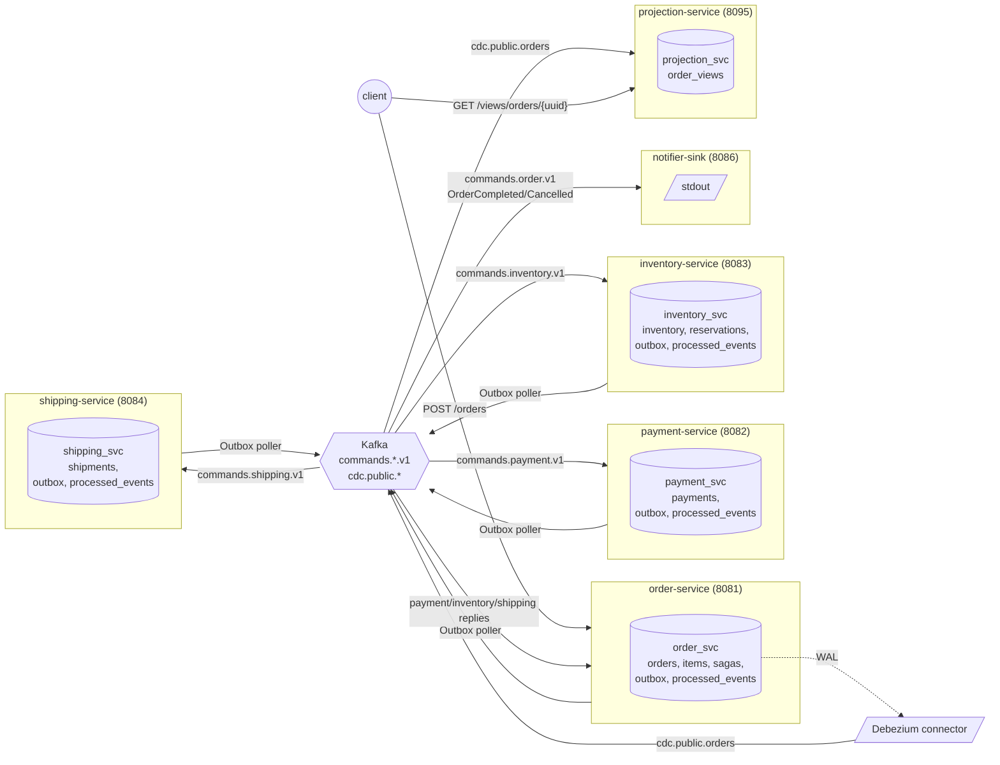
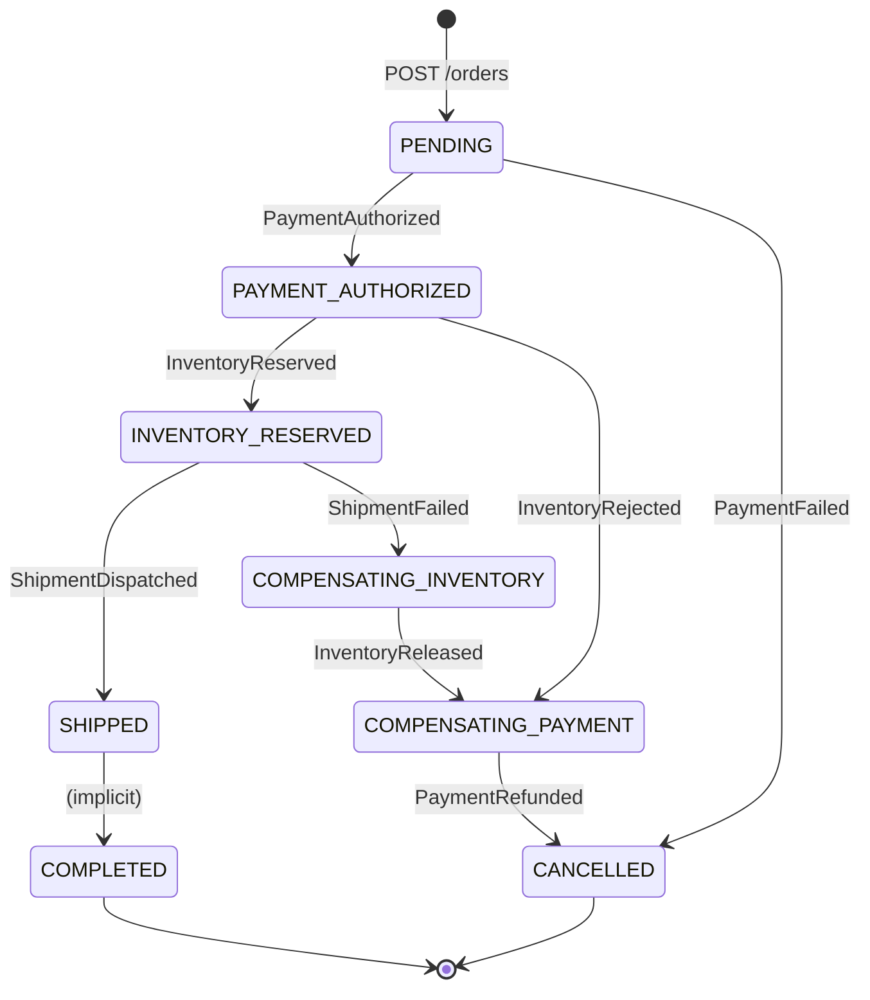

# outbox-arena

> Multi-seller marketplace order-fulfillment backbone demonstrating the **Transactional Outbox**
> pattern and **Debezium-based CDC** as the two solutions to the **dual-write problem** in
> event-driven systems. Six Spring Boot services, sharded outbox poller with
> `SELECT FOR UPDATE SKIP LOCKED`, end-to-end saga with compensation, and reproducible
> chaos scenarios that turn architectural claims into measurements.

The framing this project comes from: at scale (5-7K TPS on payment integrations), naive
write-then-publish patterns silently drop a small but non-zero fraction of events whenever
the broker, the network, or the service itself blinks. This repository is a working
production-shape system that demonstrates the patterns that eliminate that failure mode,
plus the chaos tests that turn the architecture diagram into a *measurement*.

## Headline measurements

Each row links to the chaos scenario that produced the numbers. Rerun on a clean clone with
the listed command; the output below is what those commands printed on a MacBook Pro M3 Max
running Docker Desktop 29.2.1 + Postgres 16 + Kafka 3.7 (KRaft) + Debezium 2.7.3.

| Scenario | Events posted | Events received | Loss rate | Elapsed |
|----------|---------------|-----------------|-----------|---------|
| [Happy path](chaos/scenarios/happy-path.sh): order -> payment -> inventory -> shipping -> COMPLETED | 1 | 1 | **0.00%** | 5s end-to-end |
| [Compensation: payment fails](chaos/scenarios/compensation-payment-fail.sh) -> CANCELLED, no leak | 1 | 1 cancelled | **0.00%** | 2s |
| [Compensation: inventory rejects](chaos/scenarios/compensation-inventory-reject.sh) -> refund -> CANCELLED | 1 | 1 cancelled + refunded | **0.00%** | 6s |
| [Compensation: shipment fails](chaos/scenarios/compensation-shipment-fail.sh) -> release + refund -> CANCELLED | 1 | 1 cancelled + refunded + released | **0.00%** | ~6s |
| [CDC -> projection](chaos/scenarios/cdc-projection.sh): WAL -> Debezium -> order_views read model | 1 order | 1 view row at status=COMPLETED | **0.00%** | 3s (CDC lag) |
| [Broker kill mid-publish](chaos/scenarios/chaos-broker-kill.sh): proxy cut after 20% of POSTs; 5s outage | 100 | 100 unique event-ids on topic | **0.00%** | <1s drain after heal |
| [Multi-poller race](chaos/scenarios/chaos-multi-poller-race.sh): 4 order-service instances polling same shards | 80 | 80 unique event-ids, 0 duplicates | **0.00%** | <1s drain |
| [SIGKILL order-service mid-publish](chaos/scenarios/chaos-sigkill-order-service.sh): kill at POST 15/30 with 15 unpublished outbox rows | 15 (pre-kill survivors) | 15 unique event-ids after restart | **0.00%** | <1s drain after restart |
| [Consumer rebalance](chaos/scenarios/chaos-consumer-rebalance.sh): 2 payment-service instances; kill one mid-stream | 20 | 20 payments + 20 processed_events, 0 duplicates | **0.00%** | ~45s |

Still planned (post-release polish):

| Scenario | Status |
|----------|--------|
| 1,000 orders/sec for 5 min via k6 + producer-vs-consumer audit | PLANNED |
| K8s manifests + HPA on outbox.unpublished | base SHIPPED; custom-metric HPA documented (commented out) pending Prometheus adapter |

## Architecture



The diagram makes one thing visible that every "outbox demo" repo collapses: there are
**two distinct flows of information** -- the **command plane** (Outbox-published, application
owned, drives saga transitions) and the **data plane** (CDC-published, infrastructure owned,
materialises read models). Mixing them is the single most common architectural mistake in
real systems. See [ADR-0002](docs/adr/0002-outbox-and-cdc-as-distinct-planes.md) for the
detailed reasoning.

## The dual-write problem in 4 lines

```java
// What naive code does -- and what this repo proves is broken:
transaction.begin();
orderRepository.save(order);              // (1) DB write
transaction.commit();                     // (2) commit
kafkaTemplate.send("commands.payment.v1", event);  // (3) publish (anything can fail here)
```

If the broker is unreachable between (2) and (3), the DB has the order but the world does
not -- the saga never starts, the customer waits forever. Swap (2) and (3) and the
opposite happens: a publish about an order that may not exist. The dual-write problem is
that the DB and the broker do not share a transaction.

The fix is to make them share one. Write the *intent to publish* to the database, inside
the same transaction as the business change. A separate process turns rows from that
"outbox" table into Kafka messages later. Now there is exactly one durable write per
business change; the broker publish becomes a downstream consequence that can be retried
indefinitely without losing state.

```java
// What outbox-arena does:
@Transactional
public CreateOrderResponse intake(CreateOrderRequest request) {
  Order order = orderRepository.save(new Order(...));        // business write
  sagaRepository.save(new Saga(order.getId()));              // saga state
  outboxRepository.save(new OutboxRecord(                    // intent to publish
      UUID.randomUUID(), "Payment", order.getOrderUuid().toString(),
      "PaymentRequested", payloadJson, shardKeyFor(order.getOrderUuid())));
  return new CreateOrderResponse(order.getOrderUuid(), order.getStatus(), order.getTotal());
}
```

The poller (`modules/common/.../OutboxPoller.java`) reads the outbox on a schedule:

```sql
SELECT * FROM outbox
 WHERE shard_key = ? AND published_at IS NULL
 ORDER BY id
 FOR UPDATE SKIP LOCKED
 LIMIT 500
```

`SKIP LOCKED` is the load-bearing primitive. It lets multiple poller instances run in
parallel against the same outbox without producing duplicate publishes; each instance
locks its rows, the others skip past them. The poller publishes synchronously
(`kafkaTemplate.send(message).get()`), then marks `published_at = now()` in the same
transaction. If the publish fails, the row stays unpublished and the next sweep retries.

What this does NOT solve, and the README is honest about: a poller crash *between* the
Kafka publish ack and the Postgres UPDATE re-sends the row on next sweep. Kafka's
`enable.idempotence` does not dedupe across producer sessions. The consumer side is what
catches that case, by inserting `event_id` into a `processed_events` table in the same
transaction as its business write; a duplicate-key violation means "already processed,
drop." See [ADR-0005](docs/adr/0005-sharded-outbox-poller-with-skip-locked.md) (PLANNED)
for the full reasoning.

## Saga state machine



Every transition is implemented as a Kafka listener method in `OrderSagaOrchestrator`. Each
listener wraps its handler in `IdempotentConsumer.once(eventId, group, work)` which
inserts into `processed_events` before doing the business write -- a duplicate-key
violation drops the event silently. The orchestrator also writes the *next* command's
outbox row inside the same transaction that updates the order row, so the dual-write
guarantee is preserved at *every saga step*, not just the intake.

## Stack

| Layer | Choice | Why |
|-------|--------|-----|
| Language / framework | Java 17 (toolchain) + Spring Boot 3.3 | LTS, ubiquitous in JVM systems work |
| Persistence | PostgreSQL 16 | `pgoutput` for Debezium, `SKIP LOCKED` since 9.5, `JSONB` for the outbox payload |
| Broker | Apache Kafka 3.7+ (KRaft, no ZooKeeper) | Reference broker for Debezium; KRaft removes a stateful dep |
| CDC | Debezium 2.x Postgres connector via Kafka Connect | Tails the WAL via `pgoutput` |
| Observability | Micrometer + Prometheus + Grafana + Jaeger (planned) | Industry-standard stack; one dashboard per concern |
| Chaos | Toxiproxy in front of Kafka | Programmatic broker outages, network partitions, latency injection |
| Local infra | Docker Compose | One command; matches the K8s shape coming in week 10 |
| Build | Gradle 8.10 multi-module + Jib for multi-arch images | Single version catalog, zero per-module copy-paste |
| Code style | Google Java Format via Spotless | Enforced in CI; zero bikeshedding |

## Run it

Prerequisites: Docker Desktop, JDK 21 (or any JDK 17+ -- Gradle's foojay-resolver
auto-downloads JDK 17 as the build toolchain).

```bash
# 1. Clone, configure, build.
git clone https://github.com/srivastavapalak96/outbox-arena && cd outbox-arena
./gradlew build               # compiles all 7 modules, runs Spotless, builds bootJars

# 2. Bring up infrastructure (Postgres + Kafka + Connect + Prom + Grafana + Jaeger).
make up
make health-infra             # confirms postgres + kafka + connect responding

# 3. Run the happy-path scenario end-to-end (5 saga services, real Kafka).
./chaos/scenarios/happy-path.sh
#   POSTs sample-order.json, polls until orders.status=COMPLETED, prints timing.

# 4. Run a compensation scenario to see a failure path.
./chaos/scenarios/compensation-shipment-fail.sh

# 5. Run a chaos scenario.
./chaos/scenarios/chaos-broker-kill.sh
#   Brings up Toxiproxy in front of Kafka, posts 500 orders, cuts the connection
#   mid-flight, heals it, asserts every event arrived exactly once.

# 6. Inspect the read-side CDC projection.
./chaos/scenarios/cdc-projection.sh
#   Brings up the full stack with Debezium, posts an order, asserts the
#   projection-service order_views row reaches COMPLETED via WAL tailing.

# 7. Run the full regression sweep (all 7 scenarios in sequence, ~5 minutes).
./chaos/scenarios/run-all.sh
#   Last full-sweep result (9/9 PASS, 420s wall-clock):
#     PASS  31s  happy-path.sh
#     PASS  36s  compensation-payment-fail.sh
#     PASS  33s  compensation-inventory-reject.sh
#     PASS  39s  compensation-shipment-fail.sh
#     PASS  62s  cdc-projection.sh
#     PASS  33s  chaos-broker-kill.sh
#     PASS  74s  chaos-multi-poller-race.sh
#     PASS  47s  chaos-sigkill-order-service.sh
#     PASS  65s  chaos-consumer-rebalance.sh

# 8. Look at the dashboards.
open http://localhost:3000      # Grafana (admin/admin), saga-health + outbox-health dashboards
open http://localhost:9090      # Prometheus query UI
open http://localhost:16686     # Jaeger UI (traces come in a future week)

# 9. Tear it all down.
make down-clean                 # also wipes the postgres volume
```

## Repo layout

```
modules/                        Gradle multi-module sources
  common/                       Outbox poller + scheduler, idempotency wrapper, OTel
                                helpers, shared event DTOs, processed_events repo
  order-service/                Saga orchestrator + HTTP intake (8081)
  payment-service/              Auth/capture/refund against stub gateway (8082)
  inventory-service/            Per-(sku,seller) stock; reserve/release/commit (8083)
  shipping-service/             Stub carrier dispatch w/ deterministic-fail trigger (8084)
  notifier-sink/                Terminal-state stdout sink, no DB, no outbox (8086)
  projection-service/           Pure CDC consumer of orders -> order_views (8095)

infra/                          Local dev stack
  docker-compose.yml            Postgres 16 + Kafka 3.7 KRaft + Connect + Prom + Grafana + Jaeger
  docker-compose.chaos.yml      Overlay: Toxiproxy in front of Kafka
  postgres/                     postgresql.conf (wal_level=logical), init.sql (debezium grants)
  kafka-connect/                Debezium connector JSON (table.include.list excludes outbox)
  grafana/                      Provisioned datasources + saga-health + outbox-health JSON
  prometheus/                   Scrape config for all six services

chaos/scenarios/                End-to-end verification scripts
  happy-path.sh                 The 5-second saga
  compensation-{payment,inventory,shipping}-fail.sh
                                Three failure-path scenarios
  cdc-projection.sh             WAL -> Debezium -> projection-service
  chaos-broker-kill.sh          Toxiproxy mid-flight outage

k8s/                            Kustomize manifests for kind/dev/prod (see k8s/README.md)
  base/                         Postgres StatefulSet, Strimzi Kafka, 6 services + HPA
  overlays/local-kind/          NodePort + :local image tags for kind clusters
load/                           k6 scripts (planned for week 9)

docs/
  status.md                     Live SHIPPED/PLANNED ledger
  adr/                          Architecture Decision Records (Nygard format)

buildSrc/                       Shared Gradle conventions (Jib, Spotless, JUnit, toolchain)
samples/sample-order.json       Reusable test payload
Makefile                        make up / down / health / register-connector / build / check
```

The single most important file for understanding how the dual-write problem is solved is
`modules/common/src/main/java/io/outboxarena/common/outbox/OutboxPoller.java`. Read that
first.

## ADRs

| ADR | Title | Status |
|-----|-------|--------|
| [0001](docs/adr/0001-record-architecture-decisions.md) | Record architecture decisions | Accepted |
| [0002](docs/adr/0002-outbox-and-cdc-as-distinct-planes.md) | Outbox and CDC as distinct planes | Accepted |
| [0003](docs/adr/0003-postgresql-over-mysql.md) | PostgreSQL 16 over MySQL | Accepted |
| [0004](docs/adr/0004-orchestration-saga-over-choreography.md) | Orchestration saga over choreography | Accepted |
| [0005](docs/adr/0005-sharded-outbox-poller-with-skip-locked.md) | Sharded outbox poller with `SELECT FOR UPDATE SKIP LOCKED` | Accepted |
| [0006](docs/adr/0006-postgres-processed_events-over-redis-setnx.md) | Postgres `processed_events` over Redis SETNX for consumer idempotency | Accepted |
| [0007](docs/adr/0007-no-debezium-outbox-smt.md) | No Debezium Outbox SMT (`EventRouter`) | Accepted |

## Status

See [docs/status.md](docs/status.md) for the live SHIPPED / PLANNED / DEFERRED ledger. As of
the latest commit, weeks 1-8 of the canonical plan are SHIPPED with reproducible
verification.

## License

Apache 2.0 -- see [LICENSE](LICENSE).
